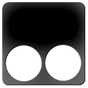

  <link rel="stylesheet" href="https://cdnjs.loli.net/ajax/libs/mdui/0.4.3/css/mdui.min.css"/>
  <link rel="stylesheet" href="./style/sty.css"/>

# 扩展列表（暂未完善）。浏览器支持在http://crx4.com 直接中下载扩展

  

    <a href="#dmlllq-extension1" class="mdui-ripple">实用工具</a>
    <a href="#dmlllq-extension2" class="mdui-ripple">购物助手</a>
    <a href="#dmlllq-extension3" class="mdui-ripple">主题背景</a>
  

  

	<!-- 第一列 -->
	

  		

  		  

  		    

   		     

    		      
  		        
Adblock Plus

  		        
广告拦截

   		     

   		     

     		     
      		    

       		     

      		        
Adblock Plus

      		        
免费的广告拦截器

      		      

       		   

      		  

      		  

Adblock Plus 已被超过 1 亿台设备使用，是世界上最受欢迎的广告拦截软件。

    		    

   		       <a class="mdui-btn mdui-ripple" href="https://llqext.dml.ink/cfhdojbkjhnklbpkdaibdccddilifddb.crx">点击安装</a>
				

  		    

  		  

  		  

  		    

   		     

    		      
  		        
AdGuard

  		        
广告拦截

   		     

   		     

     		     
      		    

       		     

      		        
AdGuard

      		        
免费的广告拦截器

      		      

       		   

      		  

      		  

一款无与伦比的广告拦截扩展，用以对抗各式广告与弹窗。可以拦截网站的广告。

    		    

   		       <button class="mdui-btn mdui-ripple">点击安装</button>
				

  		    

  		  

  		  

  		    

   		     

    		      
  		        
Chrome Better History

  		        
历史记录管理

   		     

   		     

     		     
      		    

       		     

      		        
Better History

      		        
更便利的历史记录管理

      		      

       		   

      		  

      		  

更便利的历史记录管理，更便利的历史记录管理，更便利的历史记录管理

    		    

   		       <button class="mdui-btn mdui-ripple">点击安装</button>
				

  		    

  		  

  		  

  		    

   		     

    		      
  		        
crxMouse 手势

  		        
鼠标手势

   		     

   		     

     		     
      		    

       		     

      		        
crxMouse 手势

      		        
鼠标手势，超级拖拽

      		      

       		   

      		  

      		  

方便,快捷,充分发掘鼠标的操作.功能包括鼠标手势,超级拖拽,滚轮手势,摇杆手势等

    		    

   		       <button class="mdui-btn mdui-ripple">点击安装</button>
				

  		    

  		  

  		  

  		    

   		     

    		      
  		        
Tampermonkey

  		        
用户脚本管理器

   		     

   		     

     		     
      		    

       		     

      		        
Tampermonkey

      		        
用户脚本管理器

      		      

       		   

      		  

				

Tampermonkey是世界上最受欢迎的用户脚本管理器，可以给网站执行各种脚本。

    		    

   		       <button class="mdui-btn mdui-ripple">点击安装</button>
				

  		    

  		  

  		

  		
	

	
	

  

	<!-- 第二列 -->
	

  

  	<!-- 第三列 -->
  	

